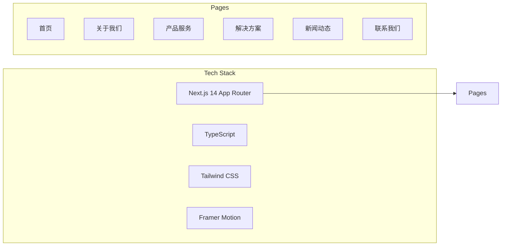

# 互联网科技企业官网设计方案

## 技术架构

- **框架**: Next.js 14 (App Router) + TypeScript
- **样式**: Tailwind CSS 4
- **动画**: Framer Motion（滚动动画 + 过渡效果）
- **图标**: Lucide React
- **部署**: 静态导出（`output: 'export'`），可部署到任意静态托管




## 设计风格

- **主色调**: 蓝紫渐变 `#6366f1` -> `#8b5cf6` -> `#a855f7`，辅助渐变 `#3b82f6` -> `#06b6d4`
- **背景**: 明亮白底 + 局部渐变色块装饰
- **卡片**: 大圆角（`rounded-2xl` / `rounded-3xl`）+ 轻投影 + hover 悬浮效果
- **字体**: 系统字体栈，标题加粗，正文舒适行高
- **动画**: 页面元素滚动渐入（fade-in + slide-up），按钮/卡片 hover 微交互

## 目录结构

```
src/
  app/
    layout.tsx              -- 根布局（Header + Footer）
    page.tsx                -- 首页
    about/page.tsx          -- 关于我们
    products/page.tsx       -- 产品服务
    solutions/page.tsx      -- 解决方案
    news/page.tsx           -- 新闻动态
    contact/page.tsx        -- 联系我们
    globals.css             -- 全局样式 + Tailwind
  components/
    layout/
      Header.tsx            -- 导航栏（响应式 + 移动端汉堡菜单）
      Footer.tsx            -- 页脚（站点链接 + 版权信息）
    ui/
      Button.tsx            -- 渐变按钮组件
      SectionTitle.tsx      -- 通用板块标题
      Card.tsx              -- 通用卡片组件
      AnimateOnScroll.tsx   -- 滚动动画包装组件
    home/
      HeroBanner.tsx        -- 首页主视觉大图
      FeatureSection.tsx    -- 核心能力展示
      DataStats.tsx         -- 数据统计展示
      PartnerLogos.tsx      -- 合作伙伴 Logo 墙
      CTASection.tsx        -- 行动号召区域
    about/
      CompanyIntro.tsx      -- 公司简介
      Timeline.tsx          -- 发展历程时间线
      TeamSection.tsx       -- 团队介绍
      CultureValues.tsx     -- 企业文化与价值观
    products/
      ProductCard.tsx       -- 产品卡片
      ProductList.tsx       -- 产品列表
    solutions/
      SolutionCard.tsx      -- 方案卡片
      IndustryTabs.tsx      -- 行业分类标签页
    news/
      NewsCard.tsx          -- 新闻卡片
      NewsList.tsx          -- 新闻列表
    contact/
      ContactForm.tsx       -- 联系表单
      ContactInfo.tsx       -- 联系方式信息
  data/
    navigation.ts           -- 导航菜单数据
    products.ts             -- 产品数据
    solutions.ts            -- 解决方案数据
    news.ts                 -- 新闻数据
    company.ts              -- 公司信息数据
  lib/
    constants.ts            -- 全局常量
```

## 页面详细设计

### 1. 首页 (`/`)

- **HeroBanner**: 全宽渐变背景 + 大标题 slogan + 副标题 + 两个 CTA 按钮（了解更多 / 联系我们），带粒子或几何装饰元素
- **FeatureSection**: 3-4 个核心能力卡片（图标 + 标题 + 描述），网格布局
- **DataStats**: 数字滚动统计区（服务客户数 / 项目数 / 团队规模 / 技术专利）
- **PartnerLogos**: 合作伙伴 Logo 滚动展示
- **CTASection**: 底部渐变行动号召区

### 2. 关于我们 (`/about`)

- **CompanyIntro**: 公司简介 + 配图
- **Timeline**: 横向/纵向时间线展示发展历程里程碑
- **CultureValues**: 4 个企业价值观卡片（创新 / 协作 / 专注 / 共赢）
- **TeamSection**: 核心团队成员展示（头像 + 姓名 + 职位 + 简介）

### 3. 产品服务 (`/products`)

- 顶部渐变标题区
- 产品卡片网格（图标 + 名称 + 描述 + 特性标签 + 了解详情按钮）
- 支持 hover 展开更多细节

### 4. 解决方案 (`/solutions`)

- 顶部行业标签切换（智慧金融 / 数字零售 / 智能制造 / 数字政务）
- 每个行业方案包含：痛点描述 + 方案概述 + 方案架构图 + 客户价值

### 5. 新闻动态 (`/news`)

- 置顶新闻大卡片
- 下方新闻列表（缩略图 + 标题 + 摘要 + 日期 + 分类标签）
- 分类筛选（公司新闻 / 行业资讯 / 技术博客）

### 6. 联系我们 (`/contact`)

- 左侧联系表单（姓名 / 邮箱 / 电话 / 公司 / 需求描述）
- 右侧联系信息（地址 / 电话 / 邮箱 / 工作时间）
- 底部地图占位区域

## 响应式策略

- **桌面端** (>= 1024px): 完整多列布局
- **平板** (768px - 1023px): 两列网格，导航折叠
- **移动端** (< 768px): 单列布局，汉堡菜单，触控友好间距

## 实施顺序

按模块递进开发，每一步完成后即可预览：

1. 初始化项目 + 配置 Tailwind + 全局样式
2. 通用组件层（Header / Footer / Button / Card / SectionTitle / AnimateOnScroll）
3. 首页（HeroBanner + FeatureSection + DataStats + PartnerLogos + CTA）
4. 关于我们页面
5. 产品服务页面
6. 解决方案页面
7. 新闻动态页面
8. 联系我们页面
9. 响应式适配 + 动画细节打磨

